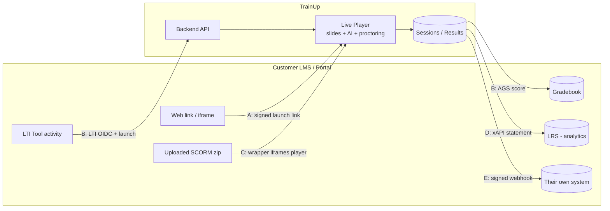
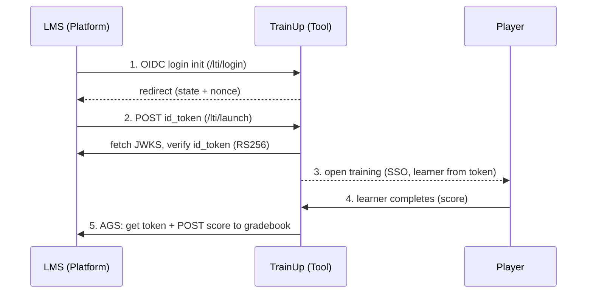
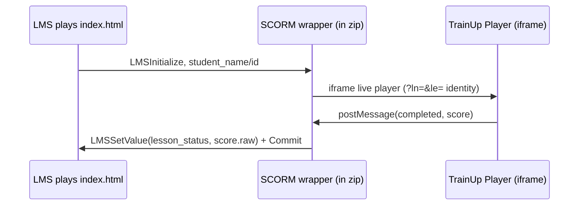

# TrainUp ↔ LMS Integration — Methods Guide & Testing Handbook

> **Audience:** the TrainUp team (devs, QA, sales/solutions).
> **Purpose:** understand each integration method, how it works, and **how to test it** — locally and against a real LMS — so everyone is in sync.

There are **5 integration methods (A–E)**. A customer can use one or several depending on what their LMS supports.

| Method | One-liner | Best for | Login? | Billable | Status |
|---|---|---|---|---|---|
| **A — Signed Launch Link** | A secure web link / iframe to a training | Any LMS / portal (web link) | No (signed) | ✅ Yes | ✅ Live |
| **B — LTI 1.3** | TrainUp as a native Tool inside the LMS | Canvas, Moodle, Blackboard, Brightspace | ✅ SSO | ✅ Yes | ✅ Built (real-LMS test pending) |
| **C — SCORM 1.2** | A `.zip` the customer uploads to their LMS | Corporate LMS (SAP, Cornerstone, Moodle) | LMS user | ✅ Yes | ✅ Built (real-LMS test pending) |
| **D — xAPI (Tin Can)** | Rich learning statements to an LRS | Customers with an LRS / analytics | n/a | ✅ Yes | ✅ Built |
| **E — Webhooks / Result Sync** | Completion + score pushed to their system | Custom / in-house portals | No | ✅ Yes | ✅ Live |

> **Key shared idea:** every method ultimately opens the **same live TrainUp player** and records the **same completion/score**. The methods differ in *how the LMS launches it* and *how results flow back*.

---

## Architecture at a glance

### How the 5 methods connect the LMS to TrainUp


### Method B (LTI 1.3) — full sequence (launch + SSO + grade)


### Method C (SCORM) — how the uploaded zip works


---

## 0. Before you test — environment setup

### 0.1 Local testing (developer machine)
By default the **frontend talks to the deployed backend** (`VITE_API_BASE_URL` in `.env` → `https://trainup.brenin.co/api-v1`). To test **local backend changes**, point the frontend at the local backend:

1. In project root `.env.local` add:
   ```
   VITE_API_BASE_URL=http://localhost:3012/api-v1
   ```
2. Start backend: `cd backend && npm run dev` (or `node server.js`) → listens on **3012**.
3. Start frontend: `npm run dev` → **http://localhost:5173**. **Restart frontend after editing `.env.local`** (Vite reads env only at startup).
4. Open **http://localhost:5173** (not the deployed URL) and log in as an **admin**.

### 0.2 Real-LMS testing
Methods **B (LTI)** and **C (SCORM)** that run *inside* a real LMS (Canvas, Moodle, SCORM Cloud) need TrainUp deployed on a **public https URL** — a real LMS (https) cannot embed a `localhost` (http) player (browser blocks mixed content). So: **deploy first**, then test those in the LMS.

### 0.3 Free tools used for testing
- **webhook.site** — free, no signup. Gives a URL that displays any incoming POST. Used to test **Webhooks (E)** and **xAPI (D)**.
- **SCORM Cloud** (cloud.scorm.com) — free tier. Upload a SCORM `.zip` and play it. Used to test **SCORM (C)** after deploy.
- **Canvas Free-for-Teacher** / **Moodle sandbox** — to test **LTI (B)** after deploy.

### 0.4 Roles & permissions
- Generating links / SCORM: any **admin / trainer / reviewer** of the tenant (the training must be **Approved** and belong to their client).
- Integration settings + test buttons: needs **settings edit** (admin).
- **Note:** **public demo links were removed** — every external delivery is now a billable launch link / LMS method. **LMS-launch completions consume credits** (like normal assignments).

---

## Method A — Signed Launch Link  *(simplest, works with any LMS)*

### What it is
A secure, signed, expiring URL to a training. Paste it into any LMS as an "External URL / Web Content" activity, or embed as an iframe.

### How it works
1. Admin generates a link → backend mints an **HMAC-signed, expiring token** (`/secure-launch/<token>`).
2. Learner opens the link → the live player runs. Identity is either baked into the link (per-learner) or asked once (generic link).
3. On completion the result is recorded and (if configured) pushed back via **Webhook (E)** / **xAPI (D)**.

### Where in the app
**Training → View Details → "Share & Embed" tab** (only for **Approved** trainings):
- **Website embed code** (iframe) + Copy
- **Generate launch link** (optional learner name/email → per-learner link; blank → generic link)
- **Download SCORM package** (Method C)

### How to test (local, 5 min)
1. Admin → open an **Approved** training → **View Details → Share & Embed**.
2. **Generate launch link** (leave learner fields blank for a generic link). Copy it.
3. Open the link in an **incognito** tab → fill name/email (generic) or it auto-starts (per-learner).
4. Complete the training.
5. Back in admin → same training → **Sessions** tab → your learner shows **completed + score**. ✅

### Real-LMS example (e.g., Moodle)
- Moodle course → *Add an activity or resource* → **External tool / URL** → paste the launch link → Save.
- Learner clicks it inside Moodle → training opens. Result comes back to TrainUp + (if set) the customer's webhook.

### Endpoints
- `POST /training-workspace/:id/launch-url` → `{ launchUrl, token, expiresInMinutes }`
- `GET /launch/secure/:token/resolve` → validates token, returns training + branding
- Frontend route: `/secure-launch/:token`

### Notes
- Default validity **7 days**; regenerate for a fresh link. Tampered/expired link → rejected.

---

## Method E — Webhooks / Auto Result Sync  *(results flow back to their system)*

### What it is
When a learner completes a training, TrainUp **POSTs a signed JSON event** to the customer's configured **Webhook URL** — so completion + score land in *their* system automatically.

### How it works
- On completion → `POST <webhookUrl>` with body (event, training, learner, score, status, time…).
- Signed: header `x-trainup-signature: sha256=<HMAC of timestamp.body>` + `x-trainup-timestamp` + `x-trainup-event`. The customer verifies with the **Signing secret**.

### Where in the app
**Settings → Integrations → method dropdown → Method E (REST API, Webhooks & SSO):**
- **Webhook URL**
- **Signing secret** (Generate button → share with the customer's developer)
- **Send webhook test** button
- **Recent webhook deliveries** log (time, event, recipient, Delivered/Failed)

### How to test (local, 3 min)
1. Open **webhook.site** → copy your unique URL.
2. App → **Settings → Integrations → Method E** → paste it in **Webhook URL** → (click **Generate** for a Signing secret) → **Save integrations**.
3. Click **Send webhook test** → on webhook.site you see a **POST** with the test payload. ✅
4. Real result: complete a training via a launch link → its completion POST appears on webhook.site, and a row appears in **Recent webhook deliveries**.

### Example payload the customer receives
```json
{
  "event": "training.completed",
  "training": { "id": "T773567", "title": "Patient Safety" },
  "learner": { "name": "Asha Rao", "email": "asha@corp.com" },
  "score": 88, "status": "completed", "progressPercent": 100, "timeSpentSeconds": 149
}
```
Verify signature (pseudo): `expected = "sha256=" + HMAC_SHA256(secret, timestamp + "." + rawBody)` must equal `x-trainup-signature`.

### Endpoints
- `POST /webhooks/test` · `GET /webhooks` (config + delivery logs)

---

## Method C — SCORM 1.2  *(upload a file to the LMS)*

### What it is
A small SCORM `.zip` the customer **uploads** to their LMS. The LMS plays it and records completion/score in its gradebook.

### How it works (dispatch wrapper)
The `.zip` is a thin wrapper, not the whole training:
- `imsmanifest.xml` (SCORM 1.2 descriptor) + `index.html` (wrapper).
- The wrapper finds the LMS's SCORM API, **iframes the live TrainUp player** (passing the LMS learner's name/id), and on completion writes `cmi.core.lesson_status = completed` + `cmi.core.score.raw` → into the LMS gradebook.

### Where in the app
**Training → View Details → Share & Embed → "Download SCORM package"** → downloads `scorm-<training>.zip`.

### How to test — Option 1: local "mock LMS" (no deploy)
A local harness simulates an LMS SCORM runtime. (Dev: see `_harness_server.js` pattern — serves a page with a mock SCORM API + the wrapper.) Open it, complete the training, and watch the panel show **Status: completed + Score**. Proves the wrapper bridges correctly. ✅

### How to test — Option 2: SCORM Cloud (real, after deploy)
1. Deploy TrainUp (public https).
2. Download the SCORM `.zip` from the app.
3. **cloud.scorm.com** (free) → *Add Content* → upload the `.zip`.
4. **Launch** it → the training plays inside SCORM Cloud.
5. Complete → SCORM Cloud shows **Complete + Score** (the gradebook entry). ✅

### Real-LMS example (Moodle)
- Moodle course → *Add activity* → **SCORM package** → upload the `.zip` → Save.
- Learner plays it; Moodle gradebook records completion + score.

### Endpoint
- `GET /training-workspace/:id/scorm-package` → streams the `.zip` (auth required).

### Notes
- Validity of the embedded launch link inside the package: **1 year**. Re-download to refresh.

---

## Method D — xAPI (Tin Can)  *(rich analytics to an LRS)*

### What it is
On completion, TrainUp sends an **xAPI 1.0.3 statement** ("Asha **completed** Patient-Safety, score 88, 2 min") to the customer's **LRS** (Learning Record Store).

### How it works
- `POST <lrsEndpoint>/statements` with the statement JSON.
- Headers: `X-Experience-API-Version: 1.0.3` + **Basic auth** (`LRS Client ID : Secret`).

### Where in the app
**Settings → Integrations → Method D (xAPI / LRS Delivery):**
- **Enable xAPI statement delivery**
- **LRS Endpoint URL**, **LRS Auth Client ID / Username**, **LRS Auth Client Secret / Password**
- **Send xAPI test** button (result also shown in the deliveries log as `xapi.completed`)

### How to test (local, 3 min — webhook.site as a fake LRS)
1. webhook.site → copy URL.
2. **Settings → Method D** → enable → **LRS Endpoint** = webhook.site URL → any Client ID/Secret → **Save**.
3. **Send xAPI test** → webhook.site shows the xAPI statement JSON (path `/statements`). ✅
4. Real: complete a training via launch link → its xAPI statement appears.

### Real LRS
Point the endpoint at a real LRS (SCORM Cloud's built-in LRS, Veracity, Learning Locker) with its key/secret. The statement appears in the LRS.

### Example statement
```json
{
  "actor": { "name": "Asha Rao", "mbox": "mailto:asha@corp.com" },
  "verb": { "id": "http://adlnet.gov/expapi/verbs/completed", "display": { "en-US": "completed" } },
  "object": { "id": "https://.../trainings/T1", "definition": { "name": { "en-US": "Patient Safety" } } },
  "result": { "completion": true, "success": true, "score": { "scaled": 0.88, "raw": 88, "min": 0, "max": 100 }, "duration": "PT120S" }
}
```

### Endpoint
- `POST /xapi/test`

### Who it's for
Niche — only customers who **have an LRS**. Strong enterprise/analytics selling point.

---

## Method B — LTI 1.3  *(native inside the LMS — gold standard)*

### What it is
TrainUp becomes an **LTI 1.3 Tool**. Learners launch trainings from inside the LMS with **single sign-on**, instructors **pick trainings via a content picker (deep linking)**, and scores flow **into the LMS gradebook (AGS)**.

### How it works (4 parts)
1. **OIDC Login** (`/lti/login`): LMS initiates login → TrainUp redirects back to the LMS auth endpoint (state + nonce).
2. **Launch** (`/lti/launch`): LMS POSTs a signed `id_token` (JWT) → TrainUp **verifies it against the LMS's public keys (JWKS)**, validates nonce/deployment, reads the learner + which training → opens the player (SSO).
3. **Deep Linking** (`/lti/deep-link/...`): instructor clicks "Add content" → TrainUp shows a **picker of approved trainings** → on select, TrainUp signs a response and the LMS stores the activity.
4. **AGS grade passback**: on completion, TrainUp gets a token from the LMS and **POSTs the score to the gradebook**.

### Tool endpoints (give these to the customer's LMS admin)
| Purpose | URL |
|---|---|
| Public keys (JWKS) | `<api>/lti/jwks` |
| OIDC Login | `<api>/lti/login` |
| Launch / Redirect | `<api>/lti/launch` |
| Deep Linking | `<api>/lti/launch` (same; message type differs) |

`<api>` = e.g. `https://trainup.brenin.co/api-v1`.

### What the customer gives us (enter in Settings → Method B)
- **LTI Client ID**, **Deployment ID**
- **Platform Keyset URL** (LMS JWKS), **OIDC Auth URL**, **Access Token URL**

### How to test — Option 1: simulated platform (no real LMS)
Automated test scripts act as a "fake Canvas": generate a platform key, serve a JWKS, mint a signed `id_token`, and exercise login → launch → AGS → deep-linking. All assertions pass (id_token verification, identity extraction, tool-signed AGS assertion, score POST, deep-link content item). This proves protocol compliance. *(See the LTI test scripts used during development.)*

### How to test — Option 2: real LMS (Canvas / Moodle, after deploy)
1. Deploy TrainUp (public https).
2. In the LMS (as admin), **register a Developer Key / External Tool (LTI 1.3)** using TrainUp's Login/Launch/JWKS URLs above; choose redirect URI = `<api>/lti/launch`.
3. The LMS gives you a **client_id + deployment_id**; copy the LMS's **keyset/auth/token URLs**.
4. Enter all of these in **TrainUp → Settings → Method B** → Save.
5. In a course, **Add content → TrainUp** → the **content picker** appears → pick a training → it's added.
6. A learner opens it → training launches (SSO). Complete → **score appears in the LMS gradebook**. ✅

> ℹ️ To tell the LMS *which* training (without deep linking), set a custom parameter `trainingid=<TrainingId>` on the link. Deep linking sets this automatically.

### Notes / limitations
- The OIDC state/nonce store is **in-memory** (fine for single instance; use a shared store for multi-instance).
- Per-customer registration handshake is required (normal for LTI).

---

## Endpoint quick reference

| Method | Endpoint | Auth |
|---|---|---|
| A | `POST /training-workspace/:id/launch-url` | admin |
| A | `GET /launch/secure/:token/resolve` | public (token) |
| C | `GET /training-workspace/:id/scorm-package` | admin |
| D | `POST /xapi/test` | settings edit |
| E | `POST /webhooks/test`, `GET /webhooks` | settings edit / view |
| B | `GET /lti/jwks` | public |
| B | `GET|POST /lti/login` | public (OIDC) |
| B | `POST /lti/launch` | public (JWT) |
| B | `GET /lti/deep-link/select`, `POST /lti/deep-link/return` | public (signed session) |

---

## Test checklist (per release)

**Local (no deploy):**
- [ ] A: generate link → complete in incognito → Sessions shows completed + score
- [ ] E: webhook.site → Send webhook test → POST received → complete training → delivery logged
- [ ] D: webhook.site as LRS → Send xAPI test → statement received
- [ ] C: download `.zip` → local mock-LMS harness → Status completed + Score
- [ ] B: simulated-platform scripts → all pass

**Real LMS (after deploy):**
- [ ] C: upload `.zip` to SCORM Cloud → launch → complete → SCORM Cloud shows score
- [ ] B: register in Canvas/Moodle → deep-link picker → launch (SSO) → score in gradebook
- [ ] A/E/D: confirm with the customer's real webhook / LRS

---

## Important behavioural notes (for everyone)

1. **Billing:** completions via LMS launch links/SCORM/LTI **consume credits + session quota**, exactly like normal assignments. If a tenant's subscription is expired or out of credits, the LMS completion is **blocked** (HTTP 402/403/400).
2. **No more free public demo:** the "Public Demo Access" option was removed. For demos, trainers use **Open Launch / Preview**, or send a (billable) launch link.
3. **One delivery log:** webhook (`training.completed`), xAPI (`xapi.completed`), and LTI (`lti.score`) deliveries all appear in **Recent webhook deliveries** under Integrations.
4. **Deploy reminder:** B and C real-LMS tests require a public https deployment; local mock harnesses cover them in dev.

---

## Troubleshooting FAQ

**Q: "You do not have permission to access this resource." on Generate link / webhook test.**
Your login role lacks the needed permission. Generate link/SCORM = admin/trainer/reviewer. Webhook/xAPI test = a role with **settings edit**. Log in as the tenant **admin**.

**Q: I changed the backend but nothing happens in the app.**
The app is probably hitting the **deployed** backend. Set `VITE_API_BASE_URL=http://localhost:3012/api-v1` in `.env.local` and **restart `npm run dev`** (Section 0.1). Confirm requests hit `localhost:3012` (Network tab).

**Q: Generate launch link / SCORM button is missing.**
The training must be **Approved**. The "Share & Embed" tab + buttons only show for approved trainings.

**Q: webhook.site shows only a GET, not my result.**
The GET is just your browser opening the URL. The real event is a **POST**. Make sure you **Saved** the Webhook URL, then click **Send webhook test** (or complete a training). Then look for a green **POST** row.

**Q: Webhook/xAPI test says delivered but customer didn't get it.**
Check the **Recent webhook deliveries** log (Delivered/Failed + HTTP status). `Failed (503)` = couldn't reach the URL (down/unreachable/internal-only). A non-2xx status = their endpoint rejected it.

**Q: Completion is blocked with "subscription expired" / 402 / 403.**
LMS-launch completions are **billable**. The tenant's subscription is expired or out of credits. Renew/top up. (This is intended — see Behavioural notes.)

**Q: SCORM package plays but shows blank / won't load in SCORM Cloud or Moodle.**
Almost always **mixed content**: the LMS is https but the package's launch URL is `http://localhost`. Generate the SCORM package from a **public https** TrainUp (deploy, or use a tunnel like ngrok — see Appendix). The local **mock-LMS harness** is the way to test SCORM without deploy.

**Q: SCORM shows completed but no score (score 0).**
The training had no quiz/questions, so score is 0 — expected. Use a training with knowledge checks to see a real score.

**Q: LTI launch fails with "id_token verification failed" / "No matching platform key".**
The **Platform Keyset URL** (LMS JWKS) is wrong/unreachable, or the LMS rotated keys. Re-copy the keyset URL from the LMS into **Settings → Method B**. Also confirm **Client ID** and **Deployment ID** match the LMS registration.

**Q: LTI launch says "did not specify which training".**
The resource link has no training. Use **deep linking** (content picker) which sets it automatically, or add custom parameter `trainingid=<TrainingId>` to the link in the LMS.

**Q: LTI "Invalid or expired launch state."**
The OIDC state is single-use and short-lived, and is held **in memory** — a backend restart or a second app instance loses it. Retry the launch; for production use a shared state store across instances.

**Q: Deep-linking picker is empty.**
No **Approved** trainings in that tenant, or the LTI registration's Client ID maps to a different tenant. Approve a training and confirm the Client ID is on the right client.

---

## Appendix — SCORM Cloud test (step-by-step)

> **Why a tunnel/deploy is needed:** SCORM Cloud runs over **https** and embeds the package's launch URL in an iframe. Browsers **block** an https page from embedding an `http://localhost` iframe (mixed content). So the SCORM package must be generated from a **public https** TrainUp. Two options below.

### Option 1 — Quick test now, without full deploy (ngrok tunnel)
1. Install **ngrok** (free): https://ngrok.com → sign up → get authtoken → `ngrok config add-authtoken <token>`.
2. Expose the **frontend**: `ngrok http 5173` → it gives a public **https** URL like `https://abc123.ngrok-free.app`.
3. Point the local frontend's API at the local backend over a second tunnel **or** keep `.env.local` as localhost (the player runs in the user's browser, which can still reach localhost for API calls — but for a clean test, also tunnel the backend `ngrok http 3012` and set `VITE_API_BASE_URL` to that https URL, then restart the frontend).
4. Open the app via the **ngrok https URL**, log in, open an Approved training → **Share & Embed → Download SCORM package**. (The package's launch URL now uses the https ngrok origin.)
5. Continue at **Step A** below.

> Simpler path if tunneling is fiddly: just **deploy** (Option 2) — it's the real-world flow anyway.

### Option 2 — After deploy (recommended)
1. Deploy TrainUp (public https, e.g. `https://trainup.brenin.co`).
2. Open the deployed app → Approved training → **Share & Embed → Download SCORM package** → save `scorm-<training>.zip`.

### Step A — Upload & play on SCORM Cloud (both options continue here)
1. Go to **https://cloud.scorm.com** → create a free account → log in.
2. **Library → Add Content → Upload** → choose the `scorm-<training>.zip` → import.
3. Open the imported course → click **Launch** (or "Test"). Enter a learner name if asked.
4. The TrainUp training should load inside SCORM Cloud and play.
5. **Complete** the training (go through slides / answer questions).
6. SCORM Cloud → the registration/result shows **Completion: Complete** and a **Score** — this is the gradebook entry an LMS would record. ✅

### What "pass" looks like
- The training renders inside SCORM Cloud's player.
- On completion, SCORM Cloud's registration report flips to **Completed** with the score.
- If it stays "Incomplete": check browser console for **mixed-content** (still pointing at http/localhost) — re-generate the package from the https origin.

---

*Architecture background: `docs/LMS_INTEGRATION_RESEARCH.md`. This guide focuses on what was built and how to test it.*
