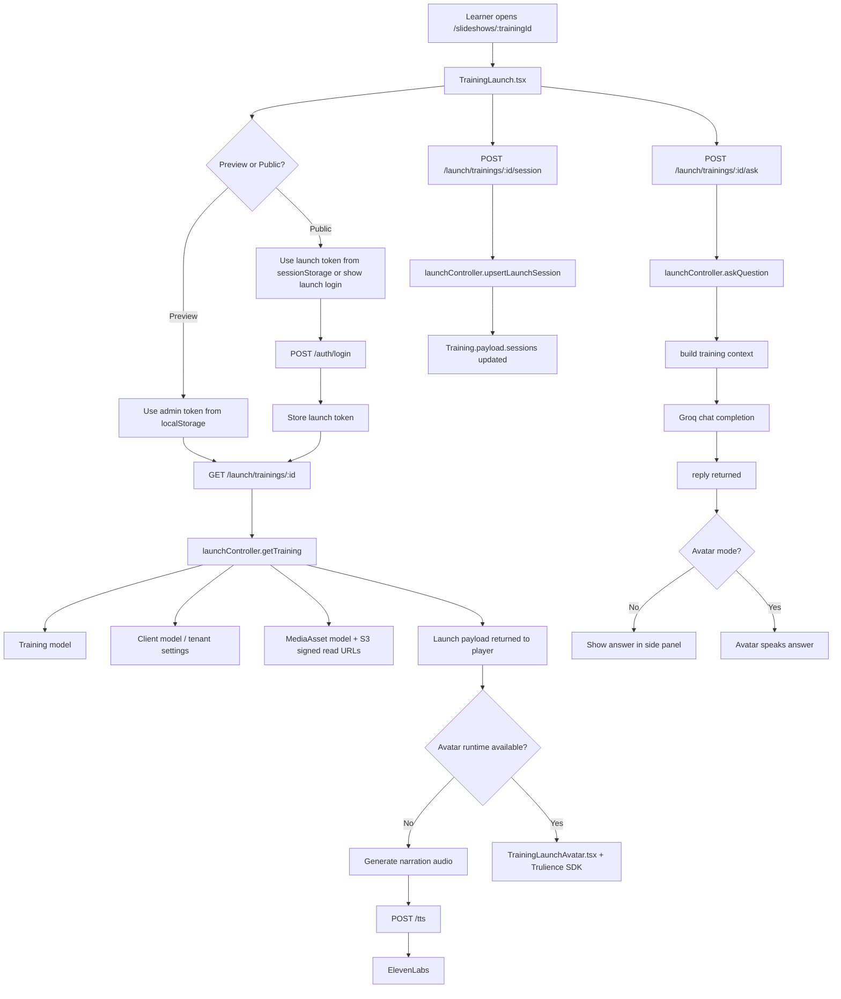

# Training Launch Player Integration Document

## Purpose

This document explains the complete Training Launch Player integration:

- how the launch player starts
- how frontend and backend connect
- which API is used for what
- how auth works
- how session tracking works
- how TTS works
- how avatar + Trulience works
- how Ask Question works
- where data is stored

This document is based on the current implementation in this repo.

## Recommended Backend Path

For the Training Launch Player, the **complete backend path is the separate Express backend** under:

- [backend](/D:/trainup/backend)

The key reason:

- the Express backend has the full launch flow
- the Vercel `api/[...route].js` path is **not** feature-complete for launch-related parity across the app

So when integrating or deploying the launch player, treat this as the main runtime path:

- Frontend: `src/routes/launch/TrainingLaunch.tsx`
- Backend: `backend/src/routes/open.routes.js`

## Main Files Involved

### Frontend

- [TrainingLaunch.tsx](/D:/trainup/src/routes/launch/TrainingLaunch.tsx)
- [TrainingLaunchAvatar.tsx](/D:/trainup/src/component/launch/TrainingLaunchAvatar.tsx)
- [scriptAudio.ts](/D:/trainup/src/helper/scriptAudio.ts)
- [runtimeApi.ts](/D:/trainup/src/helper/runtimeApi.ts)
- [authSession.ts](/D:/trainup/src/helper/authSession.ts)
- [TrainingSlideForm.tsx](/D:/trainup/src/component/training-workspace/TrainingSlideForm.tsx)

### Backend

- [open.routes.js](/D:/trainup/backend/src/routes/open.routes.js)
- [launchController.js](/D:/trainup/backend/src/controllers/launchController.js)
- [ttsController.js](/D:/trainup/backend/src/controllers/ttsController.js)
- [authController.js](/D:/trainup/backend/src/controllers/authController.js)
- [groq.js](/D:/trainup/backend/src/helpers/groq.js)
- [Training.js](/D:/trainup/backend/src/models/Training.js)
- [MediaAsset.js](/D:/trainup/backend/src/models/MediaAsset.js)
- [tenant.js](/D:/trainup/backend/src/helpers/tenant.js)
- [config/index.js](/D:/trainup/backend/src/config/index.js)

## End-To-End Workflow

## 1. Launch URL Entry

The user opens:

- `/slideshows/:trainingId`

Optional preview mode:

- `/slideshows/:trainingId?preview=1`

Frontend route:

- [TrainingLaunch.tsx](/D:/trainup/src/routes/launch/TrainingLaunch.tsx)

## 2. API Base Resolution

Frontend builds request URLs with:

- [runtimeApi.ts](/D:/trainup/src/helper/runtimeApi.ts)

Rules:

- in local/dev with backend URL configured: use `VITE_API_BASE_URL`
- in production without explicit value: fallback is currently Render backend URL

Current request builder:

- `getRequestUrl("/launch/trainings/:id")`
- final format: `{API_BASE}/launch/trainings/:id`

## 3. Auth Mode Selection

Launch player supports 2 modes:

### Preview Mode

Used by admin/internal preview.

Auth token used:

- `getAuthToken()` from localStorage

Stored key:

- `trainup--auth-token`

### Public Launch Mode

Used for actual learner access.

Auth token used:

- `getLaunchAuthToken()` from sessionStorage

Stored key:

- `trainup--launch-auth-token`

If token is missing in public mode:

- player shows the launch login form

## 4. Training Payload Load

Frontend calls:

- `GET /launch/trainings/:id`

Code path:

- frontend: [TrainingLaunch.tsx](/D:/trainup/src/routes/launch/TrainingLaunch.tsx)
- backend route: [open.routes.js](/D:/trainup/backend/src/routes/open.routes.js)
- backend handler: `launchController.getTraining`

### What this API does

- finds training by `appId`
- checks whether request is preview or public
- resolves viewer from bearer token
- validates access
- loads client/branding data
- resolves slide media URLs from S3
- returns launch-ready payload

### Access rules

#### Preview

- allowed for internal users with access to the same client
- super admin can preview

#### Public launch

- user must be authenticated
- training must be `approved`
- viewer role must be `trainee`
- viewer must belong to same `clientId`

### Response payload includes

- training metadata
- branding
- theme
- avatar config
- slide list
- per-slide media URL
- per-slide form config
- presenter notes

## 5. Media Resolution

Slide media is not stored directly inside the training payload as final URLs.

Backend process:

1. training payload contains `slide.mediaAssetId`
2. backend looks up matching record in `MediaAsset`
3. backend creates signed read URL using S3 helper
4. launch payload returns `slide.mediaUrl`

Relevant code:

- [launchController.js](/D:/trainup/backend/src/controllers/launchController.js)
- [MediaAsset.js](/D:/trainup/backend/src/models/MediaAsset.js)

## 6. Start Training

When learner clicks `Start Training`:

- frontend resets local state
- starts at slide `0`
- session tracking begins

Frontend then calls:

- `POST /launch/trainings/:id/session`

with action:

- `start`

### Session payload sent

- `action`
- `preview`
- `sessionId`
- `slidesViewed`
- `totalSlides`
- `score`
- `correctAnswers`
- `totalQuestions`
- `viewedSlideIds`
- `timeSpentSeconds`
- `startedAt`

### Backend behavior

Handler:

- `launchController.upsertLaunchSession`

What it does:

- validates launch access again
- creates session id if missing
- calculates progress
- stores learner identity
- writes session into `training.payload.sessions`
- updates training last activity
- updates client metrics

Important note:

- sessions are currently embedded inside `Training.payload.sessions`
- there is no separate session collection right now

## 7. Slide Navigation And Progress Sync

Every time slide index changes after start:

- frontend calls `syncLaunchSession("progress")`

API:

- `POST /launch/trainings/:id/session`

with action:

- `progress`

This updates:

- slides viewed
- progress percentage
- time spent
- score state
- viewed slide ids

## 8. Narration Path

There are 2 narration modes in the current player:

### Mode A: Audio playback via TTS

Used when no live avatar runtime is active.

Frontend helper:

- [scriptAudio.ts](/D:/trainup/src/helper/scriptAudio.ts)

Frontend action:

- calls `generateScriptAudioDataUri()`

Possible implementations:

- local `mespeak` generation
- remote ElevenLabs generation

### Remote TTS API

- `POST /tts`

Handler:

- `ttsController.generate`

Input:

- `text`
- `provider`
- `voiceName`
- `voiceId`
- `modelId`
- `apiKey`
- `trainingId`

What backend does:

1. resolve ElevenLabs API key
2. optionally use training manual TTS API key
3. resolve voice id
4. call ElevenLabs
5. return base64 MP3

Response:

- `audioBase64`
- `mimeType`
- `voiceId`
- `voiceName`
- `modelId`

### Mode B: Avatar speaks live

Used when `avatarEngine.avatarId` exists.

Then:

- player does **not** use audio file playback
- player sends text to Trulience avatar runtime

Frontend component:

- [TrainingLaunchAvatar.tsx](/D:/trainup/src/component/launch/TrainingLaunchAvatar.tsx)

## 9. Avatar Runtime And Trulience Flow

Frontend avatar component wraps:

- `@trulience/react-sdk`

SDK URL:

- `https://trulience.com/sdk/trulience.sdk.js`

### Avatar responsibilities

- connect avatar runtime
- mark avatar ready
- speak slide narration text
- speak AI answer text
- start mic listening
- stop mic listening
- pass transcript back to parent

### Important frontend avatar methods

- `primeAudio()`
- `speakNarration(text)`
- `speakResponse(text)`
- `stop()`
- `startListening()`
- `stopListening()`
- `setMuted(muted)`

### Important avatar events

- `auth-success`
- `websocket-connect`
- `media-connected`
- `speech-recognition-final-transcript`
- `mic-update`
- `speech-recognition-start`
- `speech-recognition-end`
- `avatar-status-update`

### Trulience backend webhook

There is also backend support for Trulience server callbacks:

- `POST /trulience`

Handler:

- `launchController.handleTrulienceEvent`

This is used for:

- session creation
- logout
- chat callbacks
- passing training context
- sending spoken reply text

Current in-memory store:

- `trulienceSessionStore`

Important:

- this store is in-memory only
- it will not survive server restart or scaling across instances

## 10. Ask Question Flow

The player supports 2 UX modes:

### Without avatar runtime

- opens side panel
- learner types question
- frontend sends question to backend
- backend returns text answer
- answer is shown in history panel

### With avatar runtime

- learner clicks ask button
- mic starts
- transcript comes back from avatar SDK
- frontend auto-submits transcript
- backend returns answer
- avatar speaks answer

## Ask Question API

- `POST /launch/trainings/:id/ask`

Handler:

- `launchController.askQuestion`

### Request body

- `message`
- `preview`
- `sessionId`
- `currentSlideId`
- `history`

### Backend behavior

1. validate access
2. load training
3. build training context from:
   - training title
   - audience
   - presenter notes
   - current slide title
   - current slide narration
   - current slide additional info
   - first slides as knowledge base
4. send prompt + context + history to Groq
5. return reply
6. if `sessionId` exists, append Q/A to session `askHistory`

### AI provider

Helper:

- [groq.js](/D:/trainup/backend/src/helpers/groq.js)

Current config:

- base URL from `GROQ_API_BASE_URL`
- API key from `GROQ_API_KEY`
- model from `GROQ_MODEL`

## 11. Slide Form Submission Flow

Inside launch, a slide can include form fields.

Frontend:

- renders [TrainingSlideForm.tsx](/D:/trainup/src/component/training-workspace/TrainingSlideForm.tsx)

Current behavior:

- evaluation is handled client-side in the player
- result updates local score state
- completion/progress score is later sent through session sync API

Current backend behavior:

- there is no dedicated form-submit API for launch
- form result contributes to:
  - `correctAnswers`
  - `totalQuestions`
  - `score`

These values are sent via:

- `POST /launch/trainings/:id/session`

## 12. Training Completion Flow

On final submit:

- frontend calls `syncLaunchSession("complete")`

API:

- `POST /launch/trainings/:id/session`

with action:

- `complete`

Backend stores:

- final status = `completed`
- completed timestamp
- final score
- viewed slide ids
- time spent

## API Map

## Core launch APIs

### `GET /launch/trainings/:id`

Purpose:

- load launch-ready training payload

Used by:

- player bootstrapping

Frontend source:

- [TrainingLaunch.tsx](/D:/trainup/src/routes/launch/TrainingLaunch.tsx)

Backend source:

- [launchController.js](/D:/trainup/backend/src/controllers/launchController.js)

### `POST /launch/trainings/:id/session`

Purpose:

- create/update learner session state

Used by:

- start
- progress updates
- completion

Frontend source:

- [TrainingLaunch.tsx](/D:/trainup/src/routes/launch/TrainingLaunch.tsx)

Backend source:

- [launchController.js](/D:/trainup/backend/src/controllers/launchController.js)

### `POST /launch/trainings/:id/ask`

Purpose:

- answer learner question with training-grounded AI response

Used by:

- text ask
- voice ask transcript flow

Frontend source:

- [TrainingLaunch.tsx](/D:/trainup/src/routes/launch/TrainingLaunch.tsx)

Backend source:

- [launchController.js](/D:/trainup/backend/src/controllers/launchController.js)

## Auth API

### `POST /auth/login`

Purpose:

- authenticate launch learner in public mode

Used by:

- launch login form

Frontend source:

- [TrainingLaunch.tsx](/D:/trainup/src/routes/launch/TrainingLaunch.tsx)

Backend source:

- [authController.js](/D:/trainup/backend/src/controllers/authController.js)

## TTS APIs

### `POST /tts`

Purpose:

- generate audio narration using ElevenLabs

Used by:

- non-avatar narration playback

Frontend source:

- [scriptAudio.ts](/D:/trainup/src/helper/scriptAudio.ts)

Backend source:

- [ttsController.js](/D:/trainup/backend/src/controllers/ttsController.js)

### `GET /tts/voices`

Purpose:

- list available ElevenLabs voices

Used by:

- builder/configuration side, not direct launch playback

### `POST /tts/verify`

Purpose:

- verify manual ElevenLabs key

Used by:

- builder/configuration side

## Narration API

### `POST /narration`

Purpose:

- generate concise slide narration script from prompt + OCR context

Used by:

- training authoring flow, not direct launch runtime

## Trulience API

### `POST /trulience`

Purpose:

- backend bridge for Trulience session/chat callbacks

Used by:

- avatar integration path

## Connectivity Diagram

## Data Flow By Layer

## Frontend State

Launch player keeps runtime state for:

- loaded training payload
- current slide index
- narration audio state
- avatar ready/muted/listening state
- viewed slide ids
- current session id
- started timestamp
- submitted forms
- score state
- question history

Most of this state is local React state.

## Backend Persistence

### `Training`

Stored in Mongo as:

- `appId`
- `clientId`
- `payload`

Launch-related persisted inside payload:

- slides
- theme
- avatar config
- presenter notes
- sessions

### `MediaAsset`

Stores:

- S3 key
- file metadata
- page number
- OCR text

### Session persistence shape

Persisted under:

- `training.payload.sessions`

Each session stores:

- `id`
- `ssoId`
- `learnerName`
- `learnerEmail`
- `status`
- `timeSpent`
- `slidesViewed`
- `totalSlides`
- `viewedSlideIds`
- `score`
- `startedAt`
- `completedAt`
- `correctAnswers`
- `totalQuestions`
- `progressPercent`
- `mode`
- `askHistory`

## Environment Variables Required For Full Launch Flow

## Required

- `MONGO_URI`
- `AUTH_SECRET`

## For media

- `AWS_ACCESS_KEY_ID`
- `AWS_SECRET_ACCESS_KEY`
- `AWS_S3_REGION`
- `AWS_S3_BUCKET`

## For TTS

- `ELEVENLABS_API_KEY`
- `ELEVENLABS_TTS_MODEL_ID`
- `ELEVENLABS_TTS_VOICE_NAME`
- `ELEVENLABS_TTS_VOICE_ID`

## For Ask Question AI

- `GROQ_API_KEY`
- `GROQ_API_BASE_URL`
- `GROQ_MODEL`
- `GROQ_SYSTEM_PROMPT`

## For Trulience avatar bridge

- `TRULIENCE_AVATAR_ID`
- `TRULIENCE_REST_API_KEY`
- `TRULIENCE_STT_PROVIDER`
- `TRULIENCE_LANGUAGE`
- `TRULIENCE_ADDITIONAL_LANGUAGES`

## Current Gaps / Risks

## 1. Public learner role dependency

The backend currently expects public launch viewer role:

- `trainee`

So public training links only work if learner accounts/token payloads are aligned to that role.

## 2. No dedicated learner auth flow yet

Current public launch login reuses:

- `POST /auth/login`

That means launch authentication is still tied to the existing user system rather than a dedicated learner access flow.

## 3. Trulience session store is in-memory

Current implementation:

- `trulienceSessionStore = new Map()`

This means:

- restart loses state
- horizontal scaling can break session continuity

## 4. Session data stored inside training payload

This is functional but not ideal for scale.

Long term, session/reporting should move into separate collections.

## 5. Vercel serverless path is not the main launch integration path

For full launch connectivity, use the Express backend.

## Recommended Integration Order

1. Configure backend env vars
2. Confirm Mongo and S3 connectivity
3. Confirm approved training records exist in `Training`
4. Confirm each launch slide with media has a valid `mediaAssetId`
5. Set frontend `VITE_API_BASE_URL`
6. Test preview flow first
7. Test public login flow
8. Test TTS playback path
9. Test Ask Question path
10. Test avatar runtime path
11. Test completion/session persistence

## Practical Summary

The Training Launch Player is a runtime that combines:

- training fetch
- access control
- slide playback
- optional audio narration
- optional live avatar narration
- learner Q&A
- progress/session persistence

The critical runtime APIs are:

- `POST /auth/login`
- `GET /launch/trainings/:id`
- `POST /launch/trainings/:id/session`
- `POST /launch/trainings/:id/ask`
- `POST /tts`
- `POST /trulience`

If you want this feature to work end-to-end in production, the cleanest current setup is:

- frontend on Vite/Vercel/static host
- backend on Express/Render
- MongoDB for training/session persistence
- S3 for slide media
- ElevenLabs for TTS
- Groq for Ask Question
- Trulience for live avatar mode

